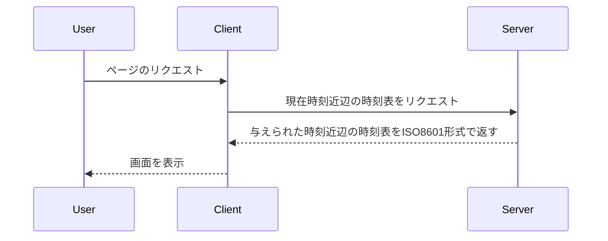

- 表示する情報
  - 現在時刻
  - n次目までの電車の時刻
  - n次目までの残り時間

```mermaid
sequenceDiagram
    participant User
    participant Client
    participant Server

    User ->> Client: ページのリクエスト
    Client ->> Server: 現在時刻近辺の時刻表をリクエスト
    Server -->> Client: 与えられた時刻近辺の時刻表をISO8601形式で返す
    Client -->> User: 画面を表示
```
